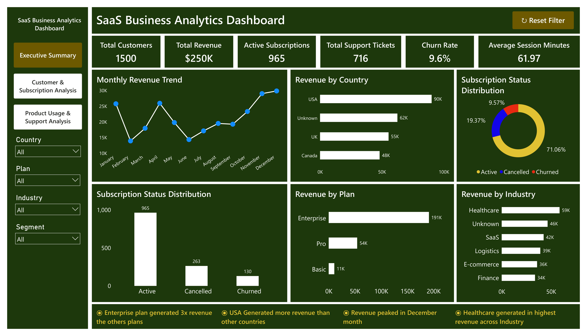
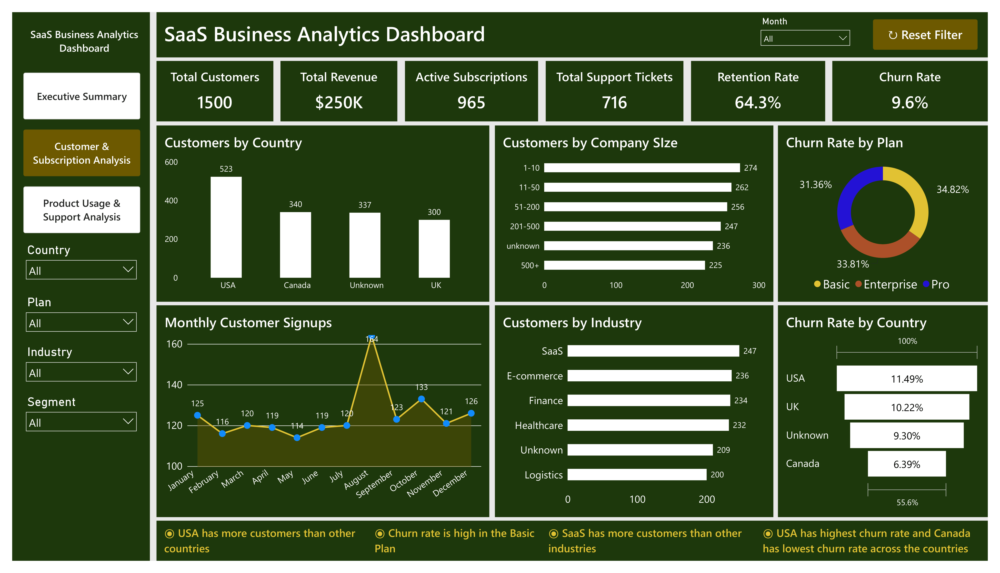
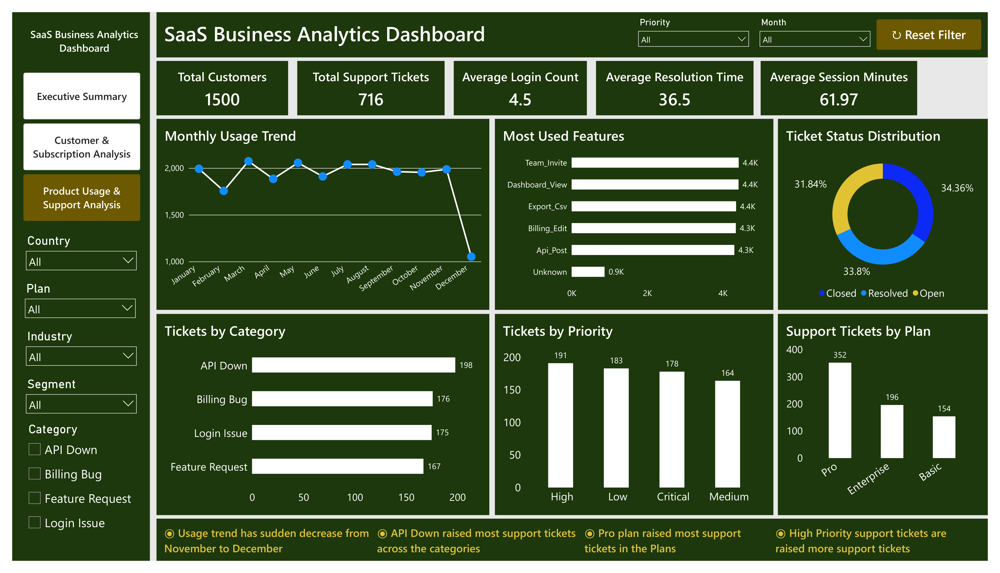

# 📊 End-to-End SaaS Business Analytics Dashboard

## 📌 Project Overview

The **End-to-End SaaS Business Analytics Dashboard** is a comprehensive Data Analytics project designed to analyze the performance of a Software-as-a-Service (SaaS) business.

The project follows the complete analytics lifecycle, beginning with raw business data and ending with an interactive Power BI dashboard. Using **Excel, Python, MySQL, and Power BI**, it transforms raw operational data into meaningful business insights that support data-driven decision-making.

---

## 🎯 Business Problem

SaaS companies generate data from multiple business operations, including customer registrations, subscriptions, payments, feature usage, and support tickets. Since this information is stored across multiple datasets, it becomes difficult for management to monitor business performance and make data-driven decisions.

This project consolidates these datasets, performs data cleaning and validation, analyzes business performance using SQL, and develops interactive dashboards to support business decision-making.

---

# 🛠️ Tools & Technologies

- Microsoft Excel
- Python
  - Pandas
  - Matplotlib
  - Seaborn
- MySQL
- Power BI

---
# ✨ Features

- End-to-End Data Analytics Project
- Data Cleaning & Validation
- Exploratory Data Analysis (EDA)
- Relational Database Design
- SQL Business Analysis
- Interactive Power BI Dashboard
- KPI Reporting & Business Insights
- Data Storytelling

---

# 📂 Dataset

The project uses six interconnected business datasets representing different operational areas of a SaaS company.

- Customers
- Plans
- Subscriptions
- Payments
- Product Usage
- Support Tickets

---

# 🔄 Project Workflow

## 📌 Phase 1 – Data Understanding (Excel)

Performed an initial review of the raw datasets.

### Tasks Performed

- Reviewed all datasets
- Understood column definitions
- Identified missing values
- Identified duplicate records
- Checked data types
- Reviewed date formats
- Understood relationships between datasets
- Planned the data cleaning strategy

---

## 🐍 Phase 2 – Data Cleaning (Python)

Cleaned and validated all six datasets using Pandas.

### Data Cleaning Tasks

- Removed duplicate records
- Handled missing values
- Standardized inconsistent values
- Converted data types
- Corrected negative payment values
- Validated Customer IDs
- Validated Subscription IDs
- Validated Plan IDs
- Verified relationships across datasets
- Exported cleaned datasets

---

## 📊 Phase 3 – Exploratory Data Analysis (Python)

Performed Exploratory Data Analysis (EDA) to understand customer behavior and business performance.

### Customer Analysis

- Customers by Country
- Customers by Industry
- Company Size Distribution
- Customer Segment Distribution
- Monthly Customer Signups

### Subscription Analysis

- Subscription Status Distribution
- Monthly Subscription Trend
- Monthly Churn Trend
- Subscription Duration Analysis

### Payment Analysis

- Monthly Revenue Trend
- Revenue by Payment Method
- Payment Status Distribution

### Product Usage Analysis

- Most Used Features
- Monthly Usage Trend

### Support Analysis

- Tickets by Priority
- Tickets by Category
- Ticket Status Distribution

---

## 🗄️ Phase 4 – SQL Database & Business Analysis

Imported the cleaned datasets into MySQL and designed a relational database using Primary and Foreign Keys to maintain data integrity.

### Database Design

- Created six tables
- Defined Primary Keys
- Defined Foreign Keys
- Established table relationships

### SQL Concepts Used

- Joins
- Aggregate Functions
- CASE WHEN
- Subqueries
- Common Table Expressions (CTEs)
- Window Functions

### Business Questions Solved

- Revenue by Country
- Revenue by Plan
- Feature Usage by Plan
- Support Tickets by Industry
- Top 10 Customers by Revenue
- Monthly Revenue by Plan
- Customers Above Average Revenue
- Customers with Multiple Subscriptions
- Plans with Highest Churn
- Countries with Highest Revenue
- Revenue Running Total
- Monthly Revenue Growth using LAG()
- Customer Lifetime Revenue Ranking

---

## 📈 Phase 5 – Power BI Dashboard

Developed a three-page interactive Power BI dashboard to monitor business performance and support data-driven decision making.

### 📌 Executive Summary

#### KPIs

- Total Customers
- Total Revenue
- Active Subscriptions
- Total Support Tickets
- Churn Rate
- Average Session Minutes

#### Visualizations

- Monthly Revenue Trend
- Revenue by Country
- Subscription Status Distribution
- Revenue by Plan
- Revenue by Industry
- Subscription Status Comparison

---

### 📌 Customer & Subscription Analysis

#### KPIs

- Total Customers
- Active Customers
- Churned Customers
- Retention Rate
- Average Subscription Duration

#### Visualizations

- Customers by Country
- Customers by Industry
- Customers by Company Size
- Monthly Customer Signups
- Churn Rate by Country
- Churn Rate by Plan

---

### 📌 Product Usage & Support Analysis

#### KPIs

- Total Customers
- Total Support Tickets
- Average Login Count
- Average Session Minutes
- Average Resolution Time

#### Visualizations

- Monthly Usage Trend
- Most Used Features
- Ticket Status Distribution
- Tickets by Category
- Tickets by Priority
- Support Tickets by Plan

---

# 📸 Dashboard Preview

## Executive Summary



## Customer & Subscription Analysis



## Product Usage & Support Analysis



---

# 🎥 Project Demonstration

https://github.com/user-attachments/assets/da298e0d-386a-4e27-b1d7-b015914909f0

---

# 📊 Key Business Insights

- Enterprise plan generated the highest revenue among all subscription plans.
- USA contributed the highest revenue across all countries.
- Revenue reached its peak in December.
- Healthcare generated the highest revenue across industries.
- Basic plan recorded the highest churn rate.
- Pro plan customers raised the highest number of support tickets.
- API-related issues generated the highest number of support requests.
- Product usage remained consistent throughout most of the year before declining in December.

---

# 📁 Project Structure

```text
SaaS-Business-Analytics/
│
├── Dataset/
│   ├── Raw Datset/
│   └── Cleaned Dataset/
│
├── Python/
│   ├── SaaS_Data_Cleaning.ipynb
│   └── SaaS_EDA.ipynb
│
├── SQL/
│   └── SaaS_SQL_Analysis.sql
│
├── Power BI/
│   ├──  SaaS_Business_Analytics.pbix
|   └──  SaaS_Business_Analytics.pdf
│
├── Dashboard Images/
│   ├── Executive_Summary.png
│   ├── Customer_Subscription_Analysis.png
│   └── Product_Usage_Support_Analysis.png
│
└── requirements.txt
└── README.md
```

---

# 💼 Skills & Concepts Demonstrated

### Excel
- Data Understanding
- Dataset Inspection
- Business Understanding

### Python
- Data Cleaning
- Missing Value Handling
- Duplicate Removal
- Data Validation
- Exploratory Data Analysis
- Data Visualization

### SQL
- Relational Database Design
- Primary & Foreign Keys
- Data Modeling
- Joins
- Aggregate Functions
- CASE WHEN
- Subqueries
- Common Table Expressions (CTEs)
- Window Functions
- Business Query Writing

### Power BI
- Data Modeling
- DAX Measures
- Interactive Dashboards
- KPI Cards
- Business Storytelling

---

# 🚀 Project Outcome

This project demonstrates the complete end-to-end data analytics workflow, beginning with raw SaaS business data and ending with an interactive business intelligence dashboard.

The solution showcases practical experience in data understanding, data cleaning, exploratory data analysis, SQL-based business analysis, relational database design, DAX, and dashboard development. It transforms raw operational data into actionable business insights that support data-driven decision-making.

This project highlights proficiency in Excel, Python, MySQL, and Power BI while following industry-standard analytics practices and serves as a comprehensive portfolio project for Data Analyst roles.

---

# 🔮 Future Enhancements

The following improvements can be added in future versions of this project:

- Deploy the Power BI dashboard to the Power BI Service.
- Add drill-through pages for detailed customer and subscription analysis.
- Implement dynamic tooltips and bookmarks for improved user experience.
- Create additional DAX measures for advanced KPIs and business metrics.
- Automate data refresh using scheduled refresh or ETL pipelines.
- Integrate real-time SaaS data using APIs.
- Build predictive models to forecast customer churn and revenue trends.
- Add Row-Level Security (RLS) for role-based dashboard access.

---

## 👨‍💻 Author

**Suji Prasanth**

**Data Analyst | Excel | Python | MySQL | Power BI**

Passionate about transforming raw data into actionable business insights through analytics, visualization, and business intelligence.

### 🌐 Connect with Me

- 💻 GitHub: https://github.com/sujiprasanth
- 💼 LinkedIn: https://www.linkedin.com/in/suji-prasanth
- 🌐 Portfolio: https://sujiprasanth.netlify.app/
